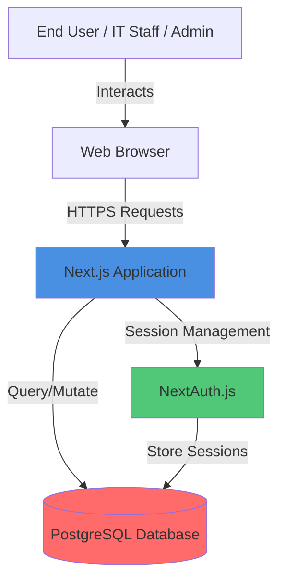
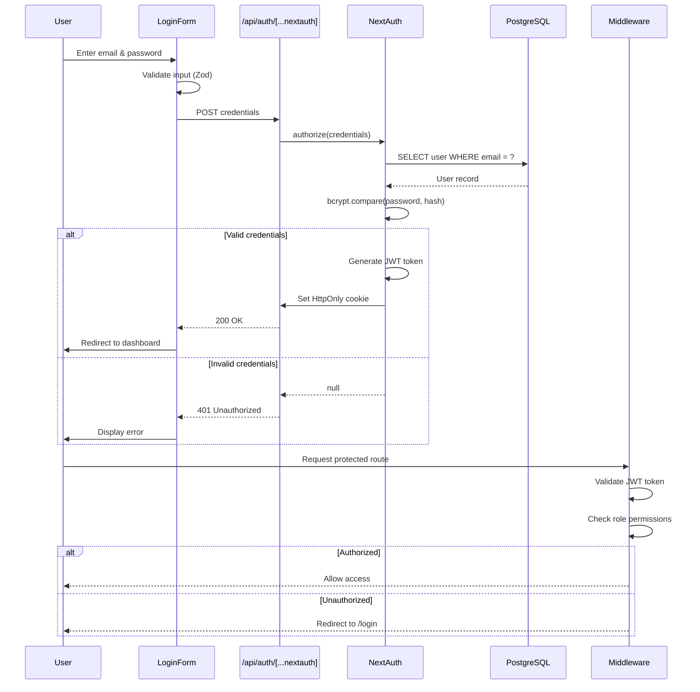
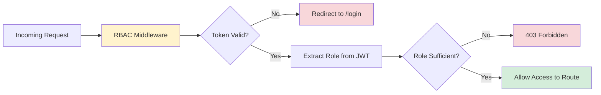

# Design Document: Secure Authentication System

## Overview

### Purpose

This design document specifies the technical architecture for a production-ready authentication and authorization system for the SwiftTriage IT ticketing platform. The system replaces the current basic authentication implementation with enhanced security hardening, improved user experience, and comprehensive protection against common web vulnerabilities.

### Design Approach

The design follows a **defense-in-depth** security model with multiple layers of protection:

1. **Frontend Layer**: Input validation, XSS prevention, accessible UI components
2. **API Layer**: Backend validation, rate limiting, CSRF protection
3. **Authentication Layer**: Secure password hashing, JWT token management
4. **Authorization Layer**: Role-based access control (RBAC) middleware
5. **Storage Layer**: HttpOnly cookies, secure session management

The system leverages **Next.js 14 App Router** architecture with:
- Server Components for secure server-side rendering
- API Routes for authentication endpoints
- Middleware for route protection and authorization
- NextAuth.js for session management

### Key Design Decisions

| Decision | Rationale | Trade-offs |
|----------|-----------|------------|
| **Email/Password Only** | Simplifies authentication flow, eliminates third-party dependencies, reduces attack surface | Users cannot use social sign-in (acceptable for enterprise ITSM) |
| **bcryptjs with 12+ salt rounds** | Industry-standard password hashing, resistant to brute force attacks | Slightly slower authentication (~200-500ms), acceptable for security gain |
| **JWT with HttpOnly Cookies** | Prevents XSS token theft, works with Next.js middleware | Requires server-side session validation, cannot be accessed by client JS |
| **8-hour session expiration** | Balances security (limits token lifetime) with UX (reduces re-auth frequency) | Users must re-authenticate daily, mitigated by "Remember Me" option |
| **Zod for validation** | Type-safe validation, runtime type checking, excellent TypeScript integration | Additional dependency, but already in use in codebase |
| **Role-based redirection** | Users immediately see relevant features based on role | Requires role embedded in JWT, increases token size slightly |

### Technology Stack

- **Framework**: Next.js 14.2.35 (App Router)
- **Authentication**: NextAuth.js 4.24.0
- **Password Hashing**: bcryptjs 3.0.3
- **Validation**: Zod 3.23.0
- **Database**: PostgreSQL (Neon serverless) with Drizzle ORM 0.30.0
- **Testing**: Vitest 4.1.5, fast-check 4.7.0 (property-based testing)

## Architecture

### System Context



### Component Architecture

```mermaid
graph TB
    subgraph "Frontend Layer"
        LoginForm[Login Form Component]
        RegisterForm[Register Form Component]
        InputValidator[Input Validator - Zod]
    end
    
    subgraph "API Layer"
        RegisterAPI[POST /api/register]
        LoginAPI[POST /api/auth/[...nextauth]]
        LogoutAPI[POST /api/logout]
        RateLimiter[Rate Limiter]
    end
    
    subgraph "Authentication Layer"
        NextAuthConfig[NextAuth Configuration]
        PasswordHasher[Password Hasher - bcryptjs]
        TokenGenerator[JWT Token Generator]
    end
    
    subgraph "Authorization Layer"
        RBACMiddleware[RBAC Middleware]
        SessionValidator[Session Validator]
    end
    
    subgraph "Data Layer"
        UserDB[Users Table]
        SessionStore[Session Store - Cookies]
    end
    
    LoginForm -->|Submit Credentials| LoginAPI
    RegisterForm -->|Submit Registration| RegisterAPI
    InputValidator -->|Validate| LoginForm
    InputValidator -->|Validate| RegisterForm
    
    RegisterAPI -->|Hash Password| PasswordHasher
    RegisterAPI -->|Create User| UserDB
    
    LoginAPI -->|Verify Credentials| NextAuthConfig
    NextAuthConfig -->|Compare Hash| PasswordHasher
    NextAuthConfig -->|Query User| UserDB
    NextAuthConfig -->|Generate Token| TokenGenerator
    TokenGenerator -->|Store Token| SessionStore
    
    RBACMiddleware -->|Validate Session| SessionValidator
    SessionValidator -->|Read Token| SessionStore
    RBACMiddleware -->|Check Role| UserDB
    
    RateLimiter -->|Protect| RegisterAPI
    RateLimiter -->|Protect| LoginAPI
    
    style LoginForm fill:#E8F4F8
    style RegisterForm fill:#E8F4F8
    style NextAuthConfig fill:#D4EDDA
    style RBACMiddleware fill:#FFF3CD
```

### Authentication Flow



### Authorization Flow (RBAC)



## Components and Interfaces

### 1. Frontend Components

#### 1.1 Login Form Component

**Location**: `app/login/page.tsx`

**Responsibilities**:
- Render login/register toggle UI
- Collect user credentials
- Perform client-side validation
- Display error messages with ARIA attributes
- Handle form submission

**Interface**:

```typescript
interface LoginFormProps {
  callbackUrl?: string; // Redirect URL after successful login
}

interface LoginFormState {
  mode: 'signin' | 'register';
  email: string;
  password: string;
  confirmPassword: string;
  errors: Record<string, string>;
  isSubmitting: boolean;
}
```

**Key Methods**:
- `handleModeToggle()`: Switch between sign-in and register modes
- `handleInputChange(field, value)`: Update form state with validation
- `handleSubmit()`: Validate and submit credentials to API
- `displayError(field, message)`: Show field-specific error with ARIA

**Validation Rules** (using Zod):
- Email: RFC 5322 compliant, max 255 chars
- Password: Min 8 chars, 1 uppercase, 1 lowercase, 1 number
- Confirm Password: Must match password field

#### 1.2 Input Validator

**Location**: `lib/validations/auth.ts`

**Responsibilities**:
- Define Zod schemas for login and registration
- Validate email format and password complexity
- Sanitize input to prevent XSS
- Provide type-safe validation results

**Interface**:

```typescript
// Existing schemas (already implemented)
export const loginSchema: z.ZodObject<{
  email: z.ZodString;
  password: z.ZodString;
}>;

export const registerSchema: z.ZodObject<{
  email: z.ZodString;
  password: z.ZodString;
  confirmPassword: z.ZodString;
}>;

export type LoginInput = z.infer<typeof loginSchema>;
export type RegisterInput = z.infer<typeof registerSchema>;
```

### 2. API Layer Components

#### 2.1 Registration API

**Location**: `app/api/register/route.ts`

**Responsibilities**:
- Validate registration payload
- Check email uniqueness
- Hash password with bcryptjs
- Create user record in database
- Return user details (excluding password hash)

**Interface**:

```typescript
// POST /api/register
interface RegisterRequest {
  email: string;
  password: string;
  confirmPassword: string;
}

interface RegisterResponse {
  success: boolean;
  user?: {
    id: string;
    email: string;
    username: string;
    role: 'end_user' | 'it_staff' | 'ADMIN';
  };
  error?: string;
}
```

**Implementation**:

```typescript
export async function POST(request: Request): Promise<Response> {
  // 1. Parse and validate request body
  const body = await request.json();
  const validation = registerSchema.safeParse(body);
  
  if (!validation.success) {
    return Response.json(
      { success: false, error: 'Invalid input' },
      { status: 400 }
    );
  }
  
  // 2. Check email uniqueness
  const existingUser = await db.query.users.findFirst({
    where: eq(users.email, validation.data.email)
  });
  
  if (existingUser) {
    return Response.json(
      { success: false, error: 'Email already exists' },
      { status: 409 }
    );
  }
  
  // 3. Hash password (12 salt rounds minimum)
  const passwordHash = await bcrypt.hash(validation.data.password, 12);
  
  // 4. Create user with default role 'end_user'
  const [newUser] = await db.insert(users).values({
    email: validation.data.email,
    username: validation.data.email.split('@')[0],
    passwordHash,
    role: 'end_user',
    isActive: true,
  }).returning();
  
  // 5. Return user details (exclude password hash)
  return Response.json({
    success: true,
    user: {
      id: newUser.id,
      email: newUser.email,
      username: newUser.username,
      role: newUser.role,
    }
  }, { status: 201 });
}
```

#### 2.2 Login API (NextAuth)

**Location**: `app/api/auth/[...nextauth]/route.ts` and `lib/auth.ts`

**Responsibilities**:
- Authenticate user credentials
- Generate JWT tokens
- Set HttpOnly cookies
- Embed role in JWT payload

**Interface**:

```typescript
// Handled by NextAuth.js
// POST /api/auth/callback/credentials
interface LoginRequest {
  email: string;
  password: string;
}

// Response: Sets HttpOnly cookie with JWT
// Cookie name: next-auth.session-token (production) or __Secure-next-auth.session-token (HTTPS)
```

**NextAuth Configuration** (existing in `lib/auth.ts`):

```typescript
export const authOptions: NextAuthOptions = {
  providers: [
    CredentialsProvider({
      async authorize(credentials) {
        // 1. Validate input
        const validation = loginSchema.safeParse(credentials);
        if (!validation.success) return null;
        
        // 2. Query user from database
        const [user] = await db.select()
          .from(users)
          .where(eq(users.email, validation.data.email))
          .limit(1);
        
        if (!user || !user.isActive) return null;
        
        // 3. Constant-time password comparison
        const isValid = await bcrypt.compare(
          validation.data.password,
          user.passwordHash
        );
        
        if (!isValid) return null;
        
        // 4. Return user with role for JWT
        return {
          id: user.id,
          email: user.email,
          name: user.username,
          role: user.role,
        };
      }
    })
  ],
  callbacks: {
    async jwt({ token, user }) {
      // Embed role in JWT at sign-in
      if (user) {
        token.role = user.role;
        token.userId = user.id;
      }
      return token;
    },
    async session({ session, token }) {
      // Expose role in session object
      session.user.role = token.role;
      session.user.id = token.userId;
      return session;
    }
  },
  session: {
    strategy: 'jwt',
    maxAge: 8 * 60 * 60, // 8 hours
  },
  secret: config.nextAuth.secret,
};
```

#### 2.3 Logout API

**Location**: `app/api/logout/route.ts` (to be created)

**Responsibilities**:
- Clear authentication cookies
- Invalidate session

**Interface**:

```typescript
// POST /api/logout
export async function POST(request: Request): Promise<Response> {
  // Clear NextAuth session cookie
  const response = Response.json({ success: true });
  
  response.headers.set(
    'Set-Cookie',
    'next-auth.session-token=; Path=/; Expires=Thu, 01 Jan 1970 00:00:00 GMT; HttpOnly; SameSite=Lax'
  );
  
  return response;
}
```

#### 2.4 Rate Limiter

**Location**: `lib/rate-limiter.ts` (to be created)

**Responsibilities**:
- Track failed login attempts per IP
- Implement sliding window rate limiting
- Return 429 Too Many Requests when limit exceeded

**Interface**:

```typescript
interface RateLimiterConfig {
  maxAttempts: number;      // Default: 5
  windowMs: number;         // Default: 15 * 60 * 1000 (15 minutes)
  blockDurationMs: number;  // Default: 15 * 60 * 1000 (15 minutes)
}

class RateLimiter {
  private attempts: Map<string, { count: number; resetAt: number }>;
  
  constructor(config: RateLimiterConfig);
  
  /**
   * Check if IP is rate limited
   * @returns true if allowed, false if blocked
   */
  check(ip: string): boolean;
  
  /**
   * Record a failed attempt
   */
  recordFailure(ip: string): void;
  
  /**
   * Reset attempts for IP (on successful login)
   */
  reset(ip: string): void;
}
```

**Implementation Strategy**:
- Use in-memory Map for simplicity (acceptable for single-instance deployment)
- For multi-instance: Use Redis or database-backed rate limiting
- Clean up expired entries periodically

### 3. Authorization Layer Components

#### 3.1 RBAC Middleware

**Location**: `middleware.ts` (Next.js middleware)

**Responsibilities**:
- Intercept requests to protected routes
- Validate JWT tokens
- Extract user role from token
- Enforce role-based access control
- Redirect unauthorized users

**Interface**:

```typescript
import { NextResponse } from 'next/server';
import type { NextRequest } from 'next/server';
import { getToken } from 'next-auth/jwt';

export async function middleware(request: NextRequest) {
  const token = await getToken({
    req: request,
    secret: process.env.NEXTAUTH_SECRET,
  });
  
  // Check if user is authenticated
  if (!token) {
    const loginUrl = new URL('/login', request.url);
    loginUrl.searchParams.set('callbackUrl', request.url);
    return NextResponse.redirect(loginUrl);
  }
  
  // Extract role from token
  const userRole = token.role as string;
  const pathname = request.nextUrl.pathname;
  
  // Define role requirements for routes
  const roleRequirements: Record<string, string[]> = {
    '/dashboard/admin': ['ADMIN'],
    '/dashboard': ['it_staff', 'ADMIN'],
    '/submit': ['end_user', 'it_staff', 'ADMIN'],
  };
  
  // Check if route has role requirements
  for (const [route, allowedRoles] of Object.entries(roleRequirements)) {
    if (pathname.startsWith(route)) {
      if (!allowedRoles.includes(userRole)) {
        return NextResponse.redirect(new URL('/403', request.url));
      }
    }
  }
  
  return NextResponse.next();
}

export const config = {
  matcher: [
    '/dashboard/:path*',
    '/submit/:path*',
    '/api/tickets/:path*',
    '/api/users/:path*',
  ],
};
```

**Role Hierarchy**:
- `end_user`: Can submit tickets, view own tickets
- `it_staff`: Can view all tickets, manage tickets, access dashboard
- `ADMIN`: Full access to all features, user management, admin dashboard

#### 3.2 Session Validator

**Location**: `lib/auth-utils.ts` (to be created)

**Responsibilities**:
- Validate JWT token signature
- Check token expiration
- Extract user information from token

**Interface**:

```typescript
import { getServerSession } from 'next-auth';
import { authOptions } from '@/lib/auth';

/**
 * Get authenticated user session (server-side only)
 */
export async function getAuthSession() {
  return await getServerSession(authOptions);
}

/**
 * Require authentication (throw if not authenticated)
 */
export async function requireAuth() {
  const session = await getAuthSession();
  if (!session) {
    throw new Error('Unauthorized');
  }
  return session;
}

/**
 * Require specific role (throw if insufficient permissions)
 */
export async function requireRole(allowedRoles: string[]) {
  const session = await requireAuth();
  const userRole = (session.user as any).role;
  
  if (!allowedRoles.includes(userRole)) {
    throw new Error('Forbidden');
  }
  
  return session;
}
```

### 4. Data Layer Components

#### 4.1 Users Table Schema

**Location**: `lib/db/schema.ts` (existing)

**Schema**:

```typescript
export const users = pgTable('users', {
  id: uuid('id').primaryKey().defaultRandom(),
  username: varchar('username', { length: 100 }).notNull().unique(),
  email: varchar('email', { length: 255 }).notNull().unique(),
  passwordHash: text('password_hash').notNull(),
  role: varchar('role', { length: 20 }).notNull().default('end_user'),
  isActive: boolean('is_active').notNull().default(true),
  createdAt: timestamp('created_at').notNull().defaultNow(),
  updatedAt: timestamp('updated_at').notNull().defaultNow(),
});
```

**Indexes** (to be added):
- `idx_users_email`: Index on email for fast lookups during login
- `idx_users_role`: Index on role for authorization queries

#### 4.2 Session Store (HttpOnly Cookies)

**Configuration**:
- Cookie name: `next-auth.session-token` (or `__Secure-next-auth.session-token` for HTTPS)
- Attributes:
  - `HttpOnly`: true (prevents JavaScript access)
  - `Secure`: true (HTTPS only, set automatically by NextAuth in production)
  - `SameSite`: 'Lax' (prevents CSRF attacks)
  - `Path`: '/' (available to all routes)
  - `Max-Age`: 28800 seconds (8 hours)

**Token Structure** (JWT):

```json
{
  "sub": "user-uuid",
  "email": "user@example.com",
  "name": "username",
  "role": "it_staff",
  "userId": "user-uuid",
  "iat": 1234567890,
  "exp": 1234596690
}
```

## Data Models

### User Model

```typescript
export type User = {
  id: string;                    // UUID
  username: string;              // Max 100 chars, unique
  email: string;                 // Max 255 chars, unique, lowercase
  passwordHash: string;          // bcryptjs hash
  role: 'end_user' | 'it_staff' | 'ADMIN';
  isActive: boolean;             // Soft delete flag
  createdAt: Date;
  updatedAt: Date;
};

export type NewUser = {
  username: string;
  email: string;
  passwordHash: string;
  role?: 'end_user' | 'it_staff' | 'ADMIN';
  isActive?: boolean;
};
```

### Session Model (JWT)

```typescript
export type SessionToken = {
  sub: string;                   // User ID
  email: string;
  name: string;                  // Username
  role: 'end_user' | 'it_staff' | 'ADMIN';
  userId: string;
  iat: number;                   // Issued at (Unix timestamp)
  exp: number;                   // Expiration (Unix timestamp)
};
```

### Validation Models

```typescript
export type LoginInput = {
  email: string;                 // RFC 5322 compliant, max 255 chars
  password: string;              // Min 1 char (no complexity check on login)
};

export type RegisterInput = {
  email: string;                 // RFC 5322 compliant, max 255 chars
  password: string;              // Min 8 chars, 1 uppercase, 1 lowercase, 1 number
  confirmPassword: string;       // Must match password
};
```

### Error Response Model

```typescript
export type AuthErrorResponse = {
  success: false;
  error: string;                 // Generic error message
  code?: string;                 // Error code for client handling
};

// Error codes
export const AuthErrorCodes = {
  INVALID_CREDENTIALS: 'INVALID_CREDENTIALS',
  EMAIL_EXISTS: 'EMAIL_EXISTS',
  VALIDATION_ERROR: 'VALIDATION_ERROR',
  RATE_LIMITED: 'RATE_LIMITED',
  ACCOUNT_LOCKED: 'ACCOUNT_LOCKED',
  UNAUTHORIZED: 'UNAUTHORIZED',
  FORBIDDEN: 'FORBIDDEN',
} as const;
```

## Correctness Properties

*A property is a characteristic or behavior that should hold true across all valid executions of a system—essentially, a formal statement about what the system should do. Properties serve as the bridge between human-readable specifications and machine-verifiable correctness guarantees.*

Before writing correctness properties, I need to perform prework analysis on the acceptance criteria to determine which are suitable for property-based testing.

