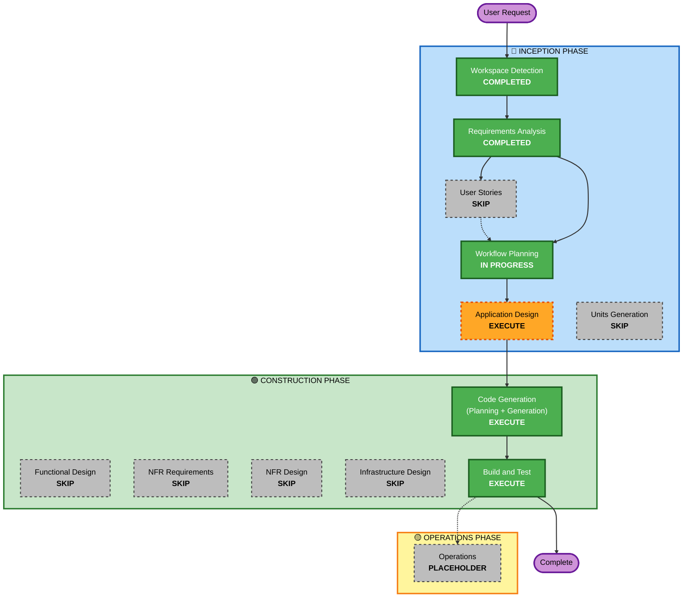

# Execution Plan - SwiftTriage

## Detailed Analysis Summary

### Project Type
- **Type**: Greenfield project
- **Complexity**: Moderate
- **Scope**: Full-stack web application with AI integration

### Change Impact Assessment
- **User-facing changes**: Yes - Complete new application with ticket submission form and IT dashboard
- **Structural changes**: Yes - New Next.js application architecture with serverless backend
- **Data model changes**: Yes - New PostgreSQL database schema with tickets table
- **API changes**: Yes - New API routes for ticket submission and retrieval
- **NFR impact**: Yes - Performance, scalability, and reliability requirements defined

### Risk Assessment
- **Risk Level**: Low-Medium
- **Rationale**: 
  - Greenfield project with no legacy constraints
  - Well-defined tech stack (Next.js, Vercel, Neon, Groq)
  - Clear requirements and simple scope
  - Serverless architecture reduces operational complexity
  - Main risk: Groq API dependency (mitigated with fallback logic)
- **Rollback Complexity**: Easy (Vercel deployment rollback)
- **Testing Complexity**: Simple (small team, manual testing acceptable)

---

## Workflow Visualization

---

## Phases to Execute

### 🔵 INCEPTION PHASE
- [x] **Workspace Detection** (COMPLETED)
  - Greenfield project detected
  - No existing code found
  
- [x] **Requirements Analysis** (COMPLETED)
  - 11 clarifying questions answered
  - Complete requirements document generated
  - Extensions configured (Security: No, PBT: No)
  
- [x] **User Stories** (SKIP)
  - **Rationale**: Simple scope with view-only ticket submission. User roles are clear (end users submit, IT staff view). No complex user journeys or acceptance criteria needed. Requirements document provides sufficient clarity.
  
- [x] **Workflow Planning** (IN PROGRESS)
  - Creating execution plan
  
- [ ] **Application Design** (EXECUTE)
  - **Rationale**: Need to define component structure for Next.js application:
    - Frontend components (TicketForm, Dashboard, StatsPanel)
    - API route handlers (triage, tickets, auth)
    - Database layer (Drizzle schema and queries)
    - Service layer (Groq AI integration, error handling)
    - Component dependencies and data flow
  
- [ ] **Units Generation** (SKIP)
  - **Rationale**: Single cohesive application, no need to decompose into multiple units. All components will be developed together as one unit in Code Generation phase.

### 🟢 CONSTRUCTION PHASE
- [ ] **Functional Design** (SKIP)
  - **Rationale**: Application Design will cover component methods and business logic. No complex algorithms or state management requiring separate functional design phase.
  
- [ ] **NFR Requirements** (SKIP)
  - **Rationale**: NFR requirements already captured in requirements document (performance, scalability, security, reliability). Tech stack already determined (Next.js, Vercel, Neon, Groq).
  
- [ ] **NFR Design** (SKIP)
  - **Rationale**: Serverless architecture (Vercel + Neon) handles most NFR concerns automatically. No custom NFR patterns needed beyond standard Next.js best practices.
  
- [ ] **Infrastructure Design** (SKIP)
  - **Rationale**: Infrastructure is fully managed (Vercel hosting, Neon database). No custom infrastructure design needed. Deployment is standard Vercel deployment.
  
- [ ] **Code Generation** (EXECUTE - ALWAYS)
  - **Part 1 - Planning**: Create detailed code generation plan with checkboxes
  - **Part 2 - Generation**: Execute plan to generate all application code
  - **Scope**:
    - Next.js project scaffolding with TypeScript and Tailwind
    - Drizzle ORM schema and configuration
    - API routes for ticket submission and retrieval
    - Frontend components (form, dashboard, stats)
    - Groq AI integration with error handling
    - Authentication implementation
    - Environment configuration
  
- [ ] **Build and Test** (EXECUTE - ALWAYS)
  - **Rationale**: Generate build instructions, test instructions, and verification steps
  - **Scope**:
    - Build instructions for Next.js application
    - Unit test instructions for API routes
    - Integration test instructions for end-to-end flow
    - Manual testing checklist

### 🟡 OPERATIONS PHASE
- [ ] **Operations** (PLACEHOLDER)
  - **Rationale**: Future deployment and monitoring workflows. Current build and test activities handled in CONSTRUCTION phase.

---

## Execution Summary

**Total Stages to Execute**: 5
1. Workspace Detection ✅
2. Requirements Analysis ✅
3. Workflow Planning ✅
4. Application Design 🔄
5. Code Generation 🔄
6. Build and Test 🔄

**Total Stages to Skip**: 8
- User Stories (simple scope)
- Units Generation (single unit)
- Functional Design (covered in App Design)
- NFR Requirements (already defined)
- NFR Design (serverless handles it)
- Infrastructure Design (fully managed)
- Operations (placeholder)

**Estimated Timeline**: 
- Application Design: 1 interaction
- Code Generation Planning: 1 interaction
- Code Generation Execution: 2-3 interactions
- Build and Test: 1 interaction
- **Total**: 5-6 interactions

---

## Success Criteria

**Primary Goal**: Deliver a working SwiftTriage application deployed to Vercel

**Key Deliverables**:
1. ✅ Complete Next.js application with TypeScript and Tailwind CSS
2. ✅ Ticket submission form with Groq AI triage integration
3. ✅ IT staff dashboard with filtering and basic statistics
4. ✅ Drizzle ORM schema and database integration with Neon
5. ✅ Role-based authentication (end users vs IT staff)
6. ✅ Error handling for Groq API failures
7. ✅ Polling mechanism for real-time dashboard updates
8. ✅ Environment configuration (.env.local template)
9. ✅ Build and deployment instructions

**Quality Gates**:
- All TypeScript code compiles without errors
- No placeholder comments or incomplete implementations
- Proper error handling with try/catch blocks
- Environment variables properly configured
- Application successfully deploys to Vercel
- Manual testing confirms all functional requirements

---

**Document Version**: 1.0  
**Created**: 2026-05-05  
**Status**: Ready for approval
